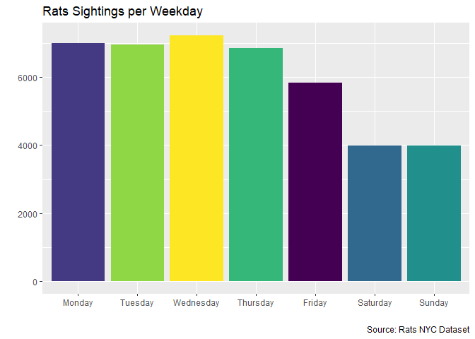
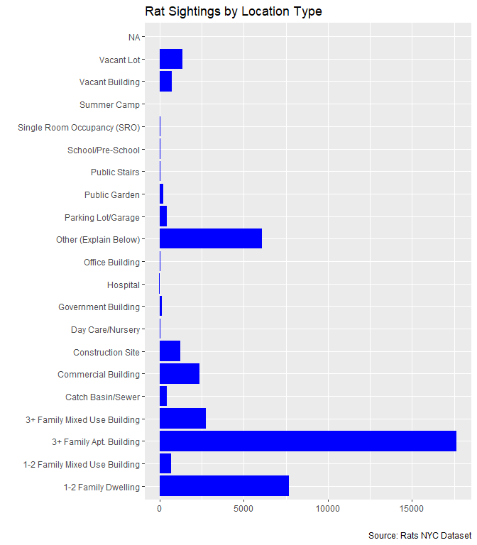
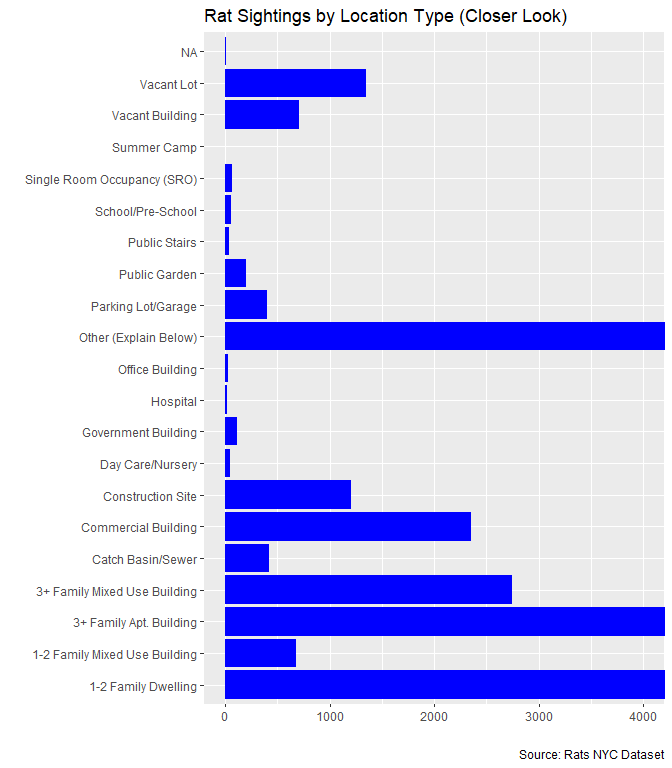
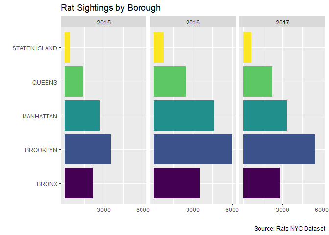

# Data Visualization Project 01

_revised version of mini-project 01 goes here_


``` r
ggplot(rats, aes(x = factor(
  sighting_weekday, levels = c(
    "Monday", "Tuesday", "Wednesday", "Thursday", "Friday", "Saturday", "Sunday"
  )), fill = sighting_weekday)) + geom_bar() + 
  scale_fill_viridis_d() +
  labs(
    title = "Rats Sightings per Weekday",
    x = "",
    y = "",
    caption = "Source: Rats NYC Dataset"
  ) + theme(legend.position = "none")
```

<!-- -->


``` r
#rework 1
p <- rats %>% filter(!is.na(location_type)) %>%
  count(location_type) %>% filter(n >= 1000) %>% ggplot(aes(x = location_type, y = n,size = n, fill = location_type, text = paste(location_type, ", Count:", n))) + geom_point() +
  scale_fill_viridis_d() +
  labs(
    title = "Rat Sightings by Location Type",
    x = "",
    y = "",
    caption = "Source: Rats NYC Dataset"
  ) + coord_flip() +
  theme(legend.position = "none", axis.text.y = element_blank(), axis.ticks.y = element_blank())

ggplotly(p, tooltip = "text")
```

```{=html}
<div class="plotly html-widget html-fill-item" id="htmlwidget-d7f3415d7cd596f33ac2" style="width:672px;height:768px;"></div>
<script type="application/json" data-for="htmlwidget-d7f3415d7cd596f33ac2">{"x":{"data":[{"x":[7669],"y":[1],"text":"1-2 Family Dwelling , Count: 7669","type":"scatter","mode":"markers","marker":{"autocolorscale":false,"color":"rgba(68,1,84,1)","opacity":1,"size":15.626703780162483,"symbol":"circle","line":{"width":1.8897637795275593,"color":"rgba(0,0,0,1)"}},"hoveron":"points","name":"1-2 Family Dwelling","legendgroup":"1-2 Family Dwelling","showlegend":true,"xaxis":"x","yaxis":"y","hoverinfo":"text","frame":null},{"x":[17652],"y":[2],"text":"3+ Family Apt. Building , Count: 17652","type":"scatter","mode":"markers","marker":{"autocolorscale":false,"color":"rgba(68,58,131,1)","opacity":1,"size":22.677165354330711,"symbol":"circle","line":{"width":1.8897637795275593,"color":"rgba(0,0,0,1)"}},"hoveron":"points","name":"3+ Family Apt. Building","legendgroup":"3+ Family Apt. Building","showlegend":true,"xaxis":"x","yaxis":"y","hoverinfo":"text","frame":null},{"x":[2742],"y":[3],"text":"3+ Family Mixed Use Building , Count: 2742","type":"scatter","mode":"markers","marker":{"autocolorscale":false,"color":"rgba(49,104,142,1)","opacity":1,"size":9.5565108085349184,"symbol":"circle","line":{"width":1.8897637795275593,"color":"rgba(0,0,0,1)"}},"hoveron":"points","name":"3+ Family Mixed Use Building","legendgroup":"3+ Family Mixed Use Building","showlegend":true,"xaxis":"x","yaxis":"y","hoverinfo":"text","frame":null},{"x":[2351],"y":[4],"text":"Commercial Building , Count: 2351","type":"scatter","mode":"markers","marker":{"autocolorscale":false,"color":"rgba(33,144,140,1)","opacity":1,"size":8.7678725726225437,"symbol":"circle","line":{"width":1.8897637795275593,"color":"rgba(0,0,0,1)"}},"hoveron":"points","name":"Commercial Building","legendgroup":"Commercial Building","showlegend":true,"xaxis":"x","yaxis":"y","hoverinfo":"text","frame":null},{"x":[1205],"y":[5],"text":"Construction Site , Count: 1205","type":"scatter","mode":"markers","marker":{"autocolorscale":false,"color":"rgba(53,183,121,1)","opacity":1,"size":3.7795275590551185,"symbol":"circle","line":{"width":1.8897637795275593,"color":"rgba(0,0,0,1)"}},"hoveron":"points","name":"Construction Site","legendgroup":"Construction Site","showlegend":true,"xaxis":"x","yaxis":"y","hoverinfo":"text","frame":null},{"x":[6093],"y":[6],"text":"Other (Explain Below) , Count: 6093","type":"scatter","mode":"markers","marker":{"autocolorscale":false,"color":"rgba(143,215,68,1)","opacity":1,"size":14.081722730121502,"symbol":"circle","line":{"width":1.8897637795275593,"color":"rgba(0,0,0,1)"}},"hoveron":"points","name":"Other (Explain Below)","legendgroup":"Other (Explain Below)","showlegend":true,"xaxis":"x","yaxis":"y","hoverinfo":"text","frame":null},{"x":[1345],"y":[7],"text":"Vacant Lot , Count: 1345","type":"scatter","mode":"markers","marker":{"autocolorscale":false,"color":"rgba(253,231,37,1)","opacity":1,"size":5.5230526127685344,"symbol":"circle","line":{"width":1.8897637795275593,"color":"rgba(0,0,0,1)"}},"hoveron":"points","name":"Vacant Lot","legendgroup":"Vacant Lot","showlegend":true,"xaxis":"x","yaxis":"y","hoverinfo":"text","frame":null}],"layout":{"margin":{"t":40.840182648401829,"r":7.3059360730593621,"b":22.648401826484026,"l":10.958904109589042},"plot_bgcolor":"rgba(235,235,235,1)","paper_bgcolor":"rgba(255,255,255,1)","font":{"color":"rgba(0,0,0,1)","family":"","size":14.611872146118724},"title":{"text":"Rat Sightings by Location Type","font":{"color":"rgba(0,0,0,1)","family":"","size":17.534246575342465},"x":0,"xref":"paper"},"xaxis":{"domain":[0,1],"automargin":true,"type":"linear","autorange":false,"range":[382.64999999999998,18474.349999999999],"tickmode":"array","ticktext":["5000","10000","15000"],"tickvals":[5000,10000,15000.000000000002],"categoryorder":"array","categoryarray":["5000","10000","15000"],"nticks":null,"ticks":"outside","tickcolor":"rgba(51,51,51,1)","ticklen":3.6529680365296811,"tickwidth":0.66417600664176002,"showticklabels":true,"tickfont":{"color":"rgba(77,77,77,1)","family":"","size":11.689497716894984},"tickangle":-0,"showline":false,"linecolor":null,"linewidth":0,"showgrid":true,"gridcolor":"rgba(255,255,255,1)","gridwidth":0.66417600664176002,"zeroline":false,"anchor":"y","title":{"text":"","font":{"color":"rgba(0,0,0,1)","family":"","size":14.611872146118724}},"hoverformat":".2f"},"yaxis":{"domain":[0,1],"automargin":true,"type":"linear","autorange":false,"range":[0.40000000000000002,7.5999999999999996],"tickmode":"array","ticktext":["1-2 Family Dwelling","3+ Family Apt. Building","3+ Family Mixed Use Building","Commercial Building","Construction Site","Other (Explain Below)","Vacant Lot"],"tickvals":[1,2,3,4.0000000000000009,5,6,7],"categoryorder":"array","categoryarray":["1-2 Family Dwelling","3+ Family Apt. Building","3+ Family Mixed Use Building","Commercial Building","Construction Site","Other (Explain Below)","Vacant Lot"],"nticks":null,"ticks":"","tickcolor":null,"ticklen":3.6529680365296811,"tickwidth":0,"showticklabels":false,"tickfont":{"color":null,"family":null,"size":0},"tickangle":-0,"showline":false,"linecolor":null,"linewidth":0,"showgrid":true,"gridcolor":"rgba(255,255,255,1)","gridwidth":0.66417600664176002,"zeroline":false,"anchor":"x","title":{"text":"","font":{"color":"rgba(0,0,0,1)","family":"","size":14.611872146118724}},"hoverformat":".2f"},"shapes":[],"showlegend":false,"legend":{"bgcolor":"rgba(255,255,255,1)","bordercolor":"transparent","borderwidth":1.8897637795275593,"font":{"color":"rgba(0,0,0,1)","family":"","size":11.689497716894984}},"hovermode":"closest","barmode":"relative"},"config":{"doubleClick":"reset","modeBarButtonsToAdd":["hoverclosest","hovercompare"],"showSendToCloud":false},"source":"A","attrs":{"28b46933504":{"x":{},"y":{},"size":{},"fill":{},"text":{},"type":"scatter"}},"cur_data":"28b46933504","visdat":{"28b46933504":["function (y) ","x"]},"highlight":{"on":"plotly_click","persistent":false,"dynamic":false,"selectize":false,"opacityDim":0.20000000000000001,"selected":{"opacity":1},"debounce":0},"shinyEvents":["plotly_hover","plotly_click","plotly_selected","plotly_relayout","plotly_brushed","plotly_brushing","plotly_clickannotation","plotly_doubleclick","plotly_deselect","plotly_afterplot","plotly_sunburstclick"],"base_url":"https://plot.ly"},"evals":[],"jsHooks":[]}</script>
```


``` r
#rework 2

p <- rats %>% filter(!is.na(location_type)) %>%
  count(location_type) %>% filter(n <= 4000) %>% ggplot(aes(x = location_type, y = n,size = n, fill = location_type, text = paste(location_type, ", Count:", n))) + geom_point() +
  scale_fill_viridis_d() +
  labs(
    title = "Rat Sightings by Location Type",
    x = "",
    y = "",
    caption = "Source: Rats NYC Dataset"
  ) + coord_flip(ylim = c(0, 4000)) +
  theme(legend.position = "none", axis.text.y = element_blank(), axis.ticks.y = element_blank())

ggplotly(p, tooltip = "text")
```

```{=html}
<div class="plotly html-widget html-fill-item" id="htmlwidget-3c59bb8d8f5f168f5bc9" style="width:672px;height:768px;"></div>
<script type="application/json" data-for="htmlwidget-3c59bb8d8f5f168f5bc9">{"x":{"data":[{"x":[676],"y":[1],"text":"1-2 Family Mixed Use Building , Count: 676","type":"scatter","mode":"markers","marker":{"autocolorscale":false,"color":"rgba(68,1,84,1)","opacity":1,"size":13.157412271273156,"symbol":"circle","line":{"width":1.8897637795275593,"color":"rgba(0,0,0,1)"}},"hoveron":"points","name":"1-2 Family Mixed Use Building","legendgroup":"1-2 Family Mixed Use Building","showlegend":true,"xaxis":"x","yaxis":"y","hoverinfo":"text","frame":null},{"x":[2742],"y":[2],"text":"3+ Family Mixed Use Building , Count: 2742","type":"scatter","mode":"markers","marker":{"autocolorscale":false,"color":"rgba(72,24,106,1)","opacity":1,"size":22.677165354330711,"symbol":"circle","line":{"width":1.8897637795275593,"color":"rgba(0,0,0,1)"}},"hoveron":"points","name":"3+ Family Mixed Use Building","legendgroup":"3+ Family Mixed Use Building","showlegend":true,"xaxis":"x","yaxis":"y","hoverinfo":"text","frame":null},{"x":[423],"y":[3],"text":"Catch Basin/Sewer , Count: 423","type":"scatter","mode":"markers","marker":{"autocolorscale":false,"color":"rgba(71,45,123,1)","opacity":1,"size":11.194494659916225,"symbol":"circle","line":{"width":1.8897637795275593,"color":"rgba(0,0,0,1)"}},"hoveron":"points","name":"Catch Basin/Sewer","legendgroup":"Catch Basin/Sewer","showlegend":true,"xaxis":"x","yaxis":"y","hoverinfo":"text","frame":null},{"x":[2351],"y":[4],"text":"Commercial Building , Count: 2351","type":"scatter","mode":"markers","marker":{"autocolorscale":false,"color":"rgba(66,64,134,1)","opacity":1,"size":21.27746800665718,"symbol":"circle","line":{"width":1.8897637795275593,"color":"rgba(0,0,0,1)"}},"hoveron":"points","name":"Commercial Building","legendgroup":"Commercial Building","showlegend":true,"xaxis":"x","yaxis":"y","hoverinfo":"text","frame":null},{"x":[1205],"y":[5],"text":"Construction Site , Count: 1205","type":"scatter","mode":"markers","marker":{"autocolorscale":false,"color":"rgba(59,82,139,1)","opacity":1,"size":16.304196248248189,"symbol":"circle","line":{"width":1.8897637795275593,"color":"rgba(0,0,0,1)"}},"hoveron":"points","name":"Construction Site","legendgroup":"Construction Site","showlegend":true,"xaxis":"x","yaxis":"y","hoverinfo":"text","frame":null},{"x":[52],"y":[6],"text":"Day Care/Nursery , Count: 52","type":"scatter","mode":"markers","marker":{"autocolorscale":false,"color":"rgba(51,99,141,1)","opacity":1,"size":6.3572615066111204,"symbol":"circle","line":{"width":1.8897637795275593,"color":"rgba(0,0,0,1)"}},"hoveron":"points","name":"Day Care/Nursery","legendgroup":"Day Care/Nursery","showlegend":true,"xaxis":"x","yaxis":"y","hoverinfo":"text","frame":null},{"x":[116],"y":[7],"text":"Government Building , Count: 116","type":"scatter","mode":"markers","marker":{"autocolorscale":false,"color":"rgba(44,114,142,1)","opacity":1,"size":7.6503381723504909,"symbol":"circle","line":{"width":1.8897637795275593,"color":"rgba(0,0,0,1)"}},"hoveron":"points","name":"Government Building","legendgroup":"Government Building","showlegend":true,"xaxis":"x","yaxis":"y","hoverinfo":"text","frame":null},{"x":[23],"y":[8],"text":"Hospital , Count: 23","type":"scatter","mode":"markers","marker":{"autocolorscale":false,"color":"rgba(38,130,142,1)","opacity":1,"size":5.4725563491952922,"symbol":"circle","line":{"width":1.8897637795275593,"color":"rgba(0,0,0,1)"}},"hoveron":"points","name":"Hospital","legendgroup":"Hospital","showlegend":true,"xaxis":"x","yaxis":"y","hoverinfo":"text","frame":null},{"x":[29],"y":[9],"text":"Office Building , Count: 29","type":"scatter","mode":"markers","marker":{"autocolorscale":false,"color":"rgba(33,144,140,1)","opacity":1,"size":5.6895216280465988,"symbol":"circle","line":{"width":1.8897637795275593,"color":"rgba(0,0,0,1)"}},"hoveron":"points","name":"Office Building","legendgroup":"Office Building","showlegend":true,"xaxis":"x","yaxis":"y","hoverinfo":"text","frame":null},{"x":[403],"y":[10],"text":"Parking Lot/Garage , Count: 403","type":"scatter","mode":"markers","marker":{"autocolorscale":false,"color":"rgba(31,159,136,1)","opacity":1,"size":11.016651820508841,"symbol":"circle","line":{"width":1.8897637795275593,"color":"rgba(0,0,0,1)"}},"hoveron":"points","name":"Parking Lot/Garage","legendgroup":"Parking Lot/Garage","showlegend":true,"xaxis":"x","yaxis":"y","hoverinfo":"text","frame":null},{"x":[200],"y":[11],"text":"Public Garden , Count: 200","type":"scatter","mode":"markers","marker":{"autocolorscale":false,"color":"rgba(39,173,129,1)","opacity":1,"size":8.8714237515111272,"symbol":"circle","line":{"width":1.8897637795275593,"color":"rgba(0,0,0,1)"}},"hoveron":"points","name":"Public Garden","legendgroup":"Public Garden","showlegend":true,"xaxis":"x","yaxis":"y","hoverinfo":"text","frame":null},{"x":[34],"y":[12],"text":"Public Stairs , Count: 34","type":"scatter","mode":"markers","marker":{"autocolorscale":false,"color":"rgba(62,188,116,1)","opacity":1,"size":5.853055886897601,"symbol":"circle","line":{"width":1.8897637795275593,"color":"rgba(0,0,0,1)"}},"hoveron":"points","name":"Public Stairs","legendgroup":"Public Stairs","showlegend":true,"xaxis":"x","yaxis":"y","hoverinfo":"text","frame":null},{"x":[57],"y":[13],"text":"School/Pre-School , Count: 57","type":"scatter","mode":"markers","marker":{"autocolorscale":false,"color":"rgba(93,200,99,1)","opacity":1,"size":6.4806670754750435,"symbol":"circle","line":{"width":1.8897637795275593,"color":"rgba(0,0,0,1)"}},"hoveron":"points","name":"School/Pre-School","legendgroup":"School/Pre-School","showlegend":true,"xaxis":"x","yaxis":"y","hoverinfo":"text","frame":null},{"x":[64],"y":[14],"text":"Single Room Occupancy (SRO) , Count: 64","type":"scatter","mode":"markers","marker":{"autocolorscale":false,"color":"rgba(130,211,77,1)","opacity":1,"size":6.6445186625423389,"symbol":"circle","line":{"width":1.8897637795275593,"color":"rgba(0,0,0,1)"}},"hoveron":"points","name":"Single Room Occupancy (SRO)","legendgroup":"Single Room Occupancy (SRO)","showlegend":true,"xaxis":"x","yaxis":"y","hoverinfo":"text","frame":null},{"x":[1],"y":[15],"text":"Summer Camp , Count: 1","type":"scatter","mode":"markers","marker":{"autocolorscale":false,"color":"rgba(170,220,50,1)","opacity":1,"size":3.7795275590551185,"symbol":"circle","line":{"width":1.8897637795275593,"color":"rgba(0,0,0,1)"}},"hoveron":"points","name":"Summer Camp","legendgroup":"Summer Camp","showlegend":true,"xaxis":"x","yaxis":"y","hoverinfo":"text","frame":null},{"x":[704],"y":[16],"text":"Vacant Building , Count: 704","type":"scatter","mode":"markers","marker":{"autocolorscale":false,"color":"rgba(213,226,26,1)","opacity":1,"size":13.349940247086675,"symbol":"circle","line":{"width":1.8897637795275593,"color":"rgba(0,0,0,1)"}},"hoveron":"points","name":"Vacant Building","legendgroup":"Vacant Building","showlegend":true,"xaxis":"x","yaxis":"y","hoverinfo":"text","frame":null},{"x":[1345],"y":[17],"text":"Vacant Lot , Count: 1345","type":"scatter","mode":"markers","marker":{"autocolorscale":false,"color":"rgba(253,231,37,1)","opacity":1,"size":17.012354637648958,"symbol":"circle","line":{"width":1.8897637795275593,"color":"rgba(0,0,0,1)"}},"hoveron":"points","name":"Vacant Lot","legendgroup":"Vacant Lot","showlegend":true,"xaxis":"x","yaxis":"y","hoverinfo":"text","frame":null}],"layout":{"margin":{"t":40.840182648401829,"r":7.3059360730593621,"b":22.648401826484026,"l":10.958904109589042},"plot_bgcolor":"rgba(235,235,235,1)","paper_bgcolor":"rgba(255,255,255,1)","font":{"color":"rgba(0,0,0,1)","family":"","size":14.611872146118724},"title":{"text":"Rat Sightings by Location Type","font":{"color":"rgba(0,0,0,1)","family":"","size":17.534246575342465},"x":0,"xref":"paper"},"xaxis":{"domain":[0,1],"automargin":true,"type":"linear","autorange":false,"range":[-200,4200],"tickmode":"array","ticktext":["0","1000","2000","3000","4000"],"tickvals":[0,1000,2000,3000,4000],"categoryorder":"array","categoryarray":["0","1000","2000","3000","4000"],"nticks":null,"ticks":"outside","tickcolor":"rgba(51,51,51,1)","ticklen":3.6529680365296811,"tickwidth":0.66417600664176002,"showticklabels":true,"tickfont":{"color":"rgba(77,77,77,1)","family":"","size":11.689497716894984},"tickangle":-0,"showline":false,"linecolor":null,"linewidth":0,"showgrid":true,"gridcolor":"rgba(255,255,255,1)","gridwidth":0.66417600664176002,"zeroline":false,"anchor":"y","title":{"text":"","font":{"color":"rgba(0,0,0,1)","family":"","size":14.611872146118724}},"hoverformat":".2f"},"yaxis":{"domain":[0,1],"automargin":true,"type":"linear","autorange":false,"range":[0.40000000000000002,17.600000000000001],"tickmode":"array","ticktext":["1-2 Family Mixed Use Building","3+ Family Mixed Use Building","Catch Basin/Sewer","Commercial Building","Construction Site","Day Care/Nursery","Government Building","Hospital","Office Building","Parking Lot/Garage","Public Garden","Public Stairs","School/Pre-School","Single Room Occupancy (SRO)","Summer Camp","Vacant Building","Vacant Lot"],"tickvals":[1,2,3,4,5,6,7,8,9,10,11,12,13,14,15,16,17],"categoryorder":"array","categoryarray":["1-2 Family Mixed Use Building","3+ Family Mixed Use Building","Catch Basin/Sewer","Commercial Building","Construction Site","Day Care/Nursery","Government Building","Hospital","Office Building","Parking Lot/Garage","Public Garden","Public Stairs","School/Pre-School","Single Room Occupancy (SRO)","Summer Camp","Vacant Building","Vacant Lot"],"nticks":null,"ticks":"","tickcolor":null,"ticklen":3.6529680365296811,"tickwidth":0,"showticklabels":false,"tickfont":{"color":null,"family":null,"size":0},"tickangle":-0,"showline":false,"linecolor":null,"linewidth":0,"showgrid":true,"gridcolor":"rgba(255,255,255,1)","gridwidth":0.66417600664176002,"zeroline":false,"anchor":"x","title":{"text":"","font":{"color":"rgba(0,0,0,1)","family":"","size":14.611872146118724}},"hoverformat":".2f"},"shapes":[],"showlegend":false,"legend":{"bgcolor":"rgba(255,255,255,1)","bordercolor":"transparent","borderwidth":1.8897637795275593,"font":{"color":"rgba(0,0,0,1)","family":"","size":11.689497716894984}},"hovermode":"closest","barmode":"relative"},"config":{"doubleClick":"reset","modeBarButtonsToAdd":["hoverclosest","hovercompare"],"showSendToCloud":false},"source":"A","attrs":{"28b4507f66db":{"x":{},"y":{},"size":{},"fill":{},"text":{},"type":"scatter"}},"cur_data":"28b4507f66db","visdat":{"28b4507f66db":["function (y) ","x"]},"highlight":{"on":"plotly_click","persistent":false,"dynamic":false,"selectize":false,"opacityDim":0.20000000000000001,"selected":{"opacity":1},"debounce":0},"shinyEvents":["plotly_hover","plotly_click","plotly_selected","plotly_relayout","plotly_brushed","plotly_brushing","plotly_clickannotation","plotly_doubleclick","plotly_deselect","plotly_afterplot","plotly_sunburstclick"],"base_url":"https://plot.ly"},"evals":[],"jsHooks":[]}</script>
```


``` r
#original 1
ggplot(rats, aes(x = location_type)) + geom_bar(fill = 'blue') +
  labs(
    title = "Rat Sightings by Location Type",
    x = "",
    y = "",
    caption = "Source: Rats NYC Dataset"
  ) + coord_flip()
```

<!-- -->


``` r
#original 2
ggplot(rats, aes(x = location_type)) + geom_bar(fill = 'blue') + 
  labs(
    title = "Rat Sightings by Location Type (Closer Look)",
    x = "",
    y = "",
    caption = "Source: Rats NYC Dataset"
  ) + coord_flip(ylim = c(0, 4000))
```

<!-- -->


``` r
ggplot(rats, aes(y = borough, fill = borough)) + geom_bar() + 
  labs(
    title = "Rat Sightings by Borough",
    x = "",
    y = "",
    caption = "Source: Rats NYC Dataset"
  ) + facet_wrap(~ sighting_year) +
  scale_fill_viridis_d() +
  scale_x_continuous(breaks = c(3000, 6000)) +
  theme(legend.position = "none")
```

<!-- -->
