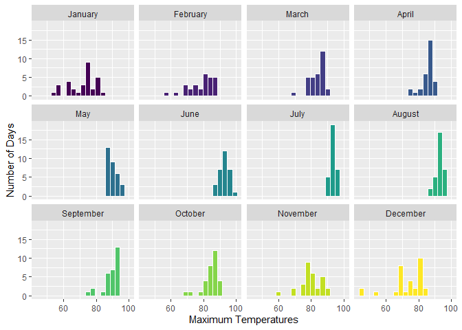
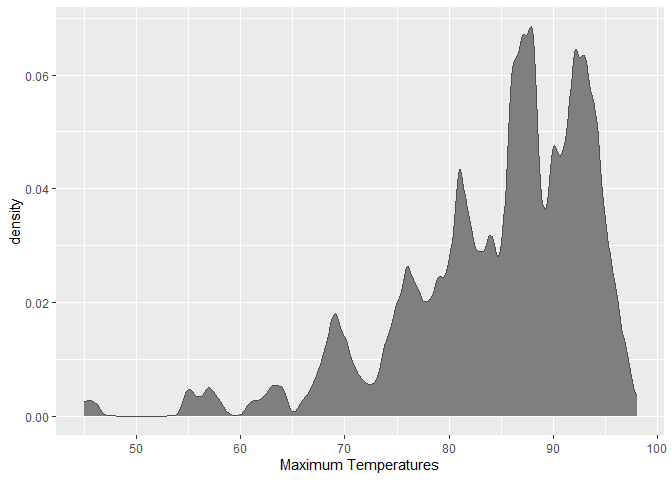
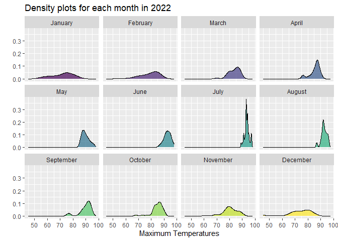
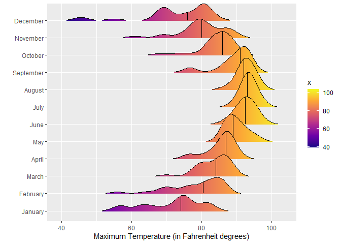
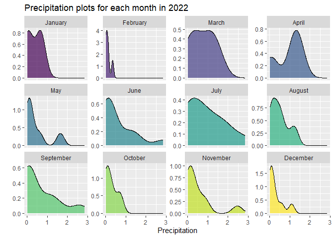
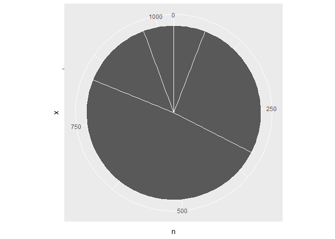
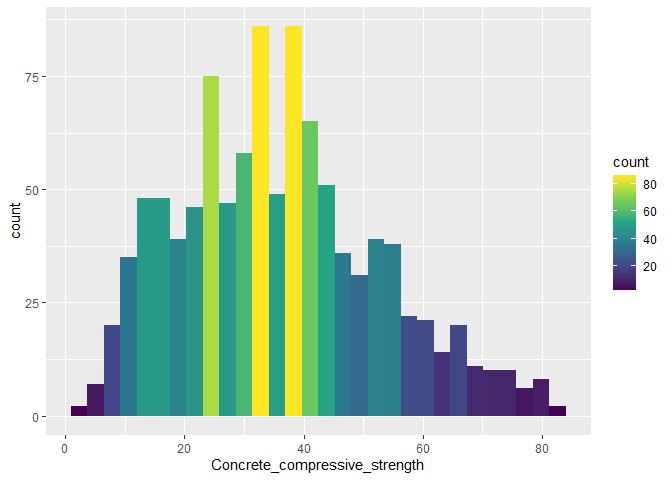
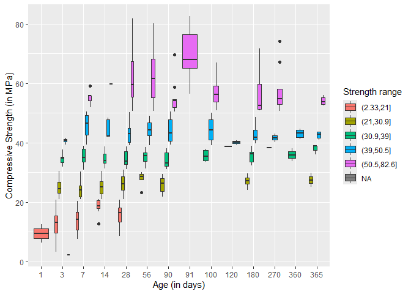
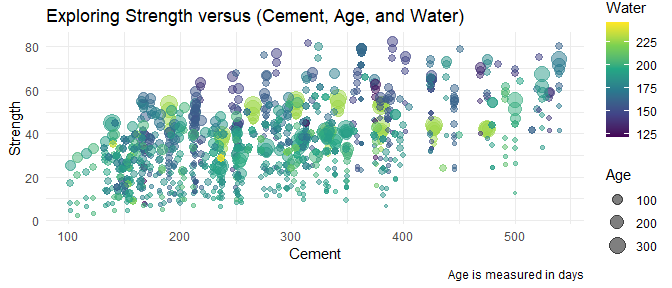

# Data Visualization Project 03


In this exercise you will explore methods to create different types of data visualizations (such as plotting text data, or exploring the distributions of continuous variables).


## PART 1: Density Plots

Using the dataset obtained from FSU's [Florida Climate Center](https://climatecenter.fsu.edu/climate-data-access-tools/downloadable-data), for a station at Tampa International Airport (TPA) for 2022, attempt to recreate the charts shown below which were generated using data from 2016. You can read the 2022 dataset using the code below: 


``` r
library(tidyverse)
library(lubridate)
weather_tpa <- read_csv("https://raw.githubusercontent.com/aalhamadani/datasets/master/tpa_weather_2022.csv")
# random sample 
sample_n(weather_tpa, 4)
```

```
## # A tibble: 4 × 7
##    year month   day precipitation max_temp min_temp ave_temp
##   <dbl> <dbl> <dbl>         <dbl>    <dbl>    <dbl>    <dbl>
## 1  2022     1    26          0.08       63       54     58.5
## 2  2022     2    24          0          86       68     77  
## 3  2022     2    20          0          82       54     68  
## 4  2022    12    18          0.04       69       51     60
```

See Slides from Week 4 of Visualizing Relationships and Models (slide 10) for a reminder on how to use this type of dataset with the `lubridate` package for dates and times (example included in the slides uses data from 2016).

Using the 2022 data: 

(a) Create a plot like the one below:


``` r
weather_2022 <- weather_tpa %>% filter(year ==2022) %>% mutate(month = factor(month.name[month], levels= month.name))

ggplot(weather_2022, aes(x = max_temp, fill = month)) +
  geom_histogram(binwidth = 3, color = 'white') +
  facet_wrap(~ month, ncol = 4) +
  scale_fill_viridis_d() +
  labs(
    x = "Maximum Temperatures",
    y = "Number of Days"
  ) +
  theme(legend.position = "none")
```

<!-- -->

Hint: the option `binwidth = 3` was used with the `geom_histogram()` function.

(b) Create a plot like the one below:


``` r
ggplot(weather_2022, aes(x = max_temp)) +
  geom_density(fill = 'grey50', color = 'grey30', adjust = .2) +
  labs(
    x = "Maximum Temperatures",
    y = "density"
  ) +
  theme(legend.position = "none")
```

<!-- -->

Hint: check the `kernel` parameter of the `geom_density()` function, and use `bw = 0.5`.

(c) Create a plot like the one below:


``` r
ggplot(weather_2022, aes(x = max_temp, fill = month)) +
  geom_density(binwidth = 3, color = 'black', alpha = .7) +
  facet_wrap(~ month, ncol = 4) +
  scale_fill_viridis_d() +
  labs(
    title = "Density plots for each month in 2022",
    x = "Maximum Temperatures",
    y = ""
  ) +
  theme(legend.position = "none")
```

<!-- -->

Hint: default options for `geom_density()` were used. 

(d) Generate a plot like the chart below:


``` r
library(ggridges)

ggplot(weather_2022, aes(x = max_temp,y = month, fill = after_stat(x))) +
  geom_density_ridges_gradient(color = 'black', quantile_lines = TRUE, quantiles = 2, scale = 2, rel_min_height = .01) +
  scale_fill_viridis_c(option = "plasma") +
  labs(
    x = "Maximum Temperature (in Fahrenheit degrees)",
    y = ""
  )
```

<!-- -->

Hint: use the`{ggridges}` package, and the `geom_density_ridges()` function paying close attention to the `quantile_lines` and `quantiles` parameters. The plot above uses the `plasma` option (color scale) for the _viridis_ palette.


(e) Create a plot of your choice that uses the attribute for precipitation _(values of -99.9 for temperature or -99.99 for precipitation represent missing data)_.


``` r
weather_precip <- weather_2022 %>% filter(!is.na(precipitation), precipitation != -99.99, precipitation > .01)

ggplot(weather_precip, aes(x = precipitation, fill = month)) +
  geom_density(binwidth = 3, color = 'black', alpha = .7) +
  facet_wrap(~ month, ncol = 4, scales = "free_y") +
  scale_fill_viridis_d() +
  labs(
    title = "Precipitation plots for each month in 2022",
    x = "Precipitation",
    y = ""
  ) +
  theme(legend.position = "none")
```

<!-- -->

## PART 2 

> **You can choose to work on either Option (A) or Option (B)**. Remove from this template the option you decided not to work on. 

### Option (B): Data on Concrete Strength 

Concrete is the most important material in **civil engineering**. The concrete compressive strength is a highly nonlinear function of _age_ and _ingredients_. The dataset used here is from the [UCI Machine Learning Repository](https://archive.ics.uci.edu/ml/index.php), and it contains 1030 observations with 9 different attributes 9 (8 quantitative input variables, and 1 quantitative output variable). A data dictionary is included below: 


Variable                      |    Notes                
------------------------------|-------------------------------------------
Cement                        | kg in a $m^3$ mixture             
Blast Furnace Slag            | kg in a $m^3$ mixture  
Fly Ash                       | kg in a $m^3$ mixture             
Water                         | kg in a $m^3$ mixture              
Superplasticizer              | kg in a $m^3$ mixture
Coarse Aggregate              | kg in a $m^3$ mixture
Fine Aggregate                | kg in a $m^3$ mixture      
Age                           | in days                                             
Concrete compressive strength | MPa, megapascals


Below we read the `.csv` file using `readr::read_csv()` (the `readr` package is part of the `tidyverse`)


``` r
concrete <- read_csv("../data/concrete.csv", col_types = cols())
```


Let us create a new attribute for visualization purposes, `strength_range`: 


``` r
new_concrete <- concrete %>%
  mutate(strength_range = cut(Concrete_compressive_strength, 
                              breaks = quantile(Concrete_compressive_strength, 
                                                probs = seq(0, 1, 0.2))) )
```


1. Explore the distribution of 2 of the continuous variables available in the dataset. Do ranges make sense? Comment on your findings.

``` r
head(new_concrete)
```

```
## # A tibble: 6 × 10
##   Cement Blast_Furnace_Slag Fly_Ash Water Superplasticizer Coarse_Aggregate
##    <dbl>              <dbl>   <dbl> <dbl>            <dbl>            <dbl>
## 1   540                  0        0   162              2.5            1040 
## 2   540                  0        0   162              2.5            1055 
## 3   332.               142.       0   228              0               932 
## 4   332.               142.       0   228              0               932 
## 5   199.               132.       0   192              0               978.
## 6   266                114        0   228              0               932 
## # ℹ 4 more variables: Fine_Aggregate <dbl>, Age <dbl>,
## #   Concrete_compressive_strength <dbl>, strength_range <fct>
```


``` r
#pie chart version for bad graph
new_concrete %>% mutate(water_range = cut(Water, breaks = 5)) %>% count(water_range) %>%
ggplot(aes(x = "", y = n, fill - water_range))+ geom_col(color = 'white') + scale_fill_viridis_d() + 
  coord_polar(theta = "y")
```

<!-- -->


``` r
library(plotly)
```

```
## 
## Attaching package: 'plotly'
```

```
## The following object is masked from 'package:ggplot2':
## 
##     last_plot
```

```
## The following object is masked from 'package:stats':
## 
##     filter
```

```
## The following object is masked from 'package:graphics':
## 
##     layout
```

``` r
library(htmlwidgets)
#histogram for good graph and interactibility
p <- ggplot(new_concrete, aes(x = Water, fill = after_stat(count)))+ geom_histogram() + scale_fill_viridis_c()
ggplotly(p)
```

```
## `stat_bin()` using `bins = 30`. Pick better value `binwidth`.
```

```{=html}
<div class="plotly html-widget html-fill-item" id="htmlwidget-11649052d38c8e83dfbd" style="width:672px;height:480px;"></div>
<script type="application/json" data-for="htmlwidget-11649052d38c8e83dfbd">{"x":{"data":[{"orientation":"v","width":[4.318965517241395,4.318965517241395,4.318965517241395,4.318965517241395,4.318965517241395],"base":[0,0,0,0,0],"x":[130.38793103448276,134.70689655172413,225.40517241379308,234.04310344827587,242.68103448275861],"y":[0,0,0,0,0],"text":["count:   0<br />Water: 130.3879<br />count:   0","count:   0<br />Water: 134.7069<br />count:   0","count:   0<br />Water: 225.4052<br />count:   0","count:   0<br />Water: 234.0431<br />count:   0","count:   0<br />Water: 242.6810<br />count:   0"],"type":"bar","textposition":"none","marker":{"autocolorscale":false,"color":"rgba(68,1,84,1)","line":{"width":1.8897637795275593,"color":"transparent"}},"showlegend":false,"xaxis":"x","yaxis":"y","hoverinfo":"text","frame":null},{"orientation":"v","width":[4.318965517241395,4.3189655172413381,4.318965517241395],"base":[0,0,0],"x":[216.76724137931035,238.36206896551724,247],"y":[2,2,2],"text":["count:   2<br />Water: 216.7672<br />count:   2","count:   2<br />Water: 238.3621<br />count:   2","count:   2<br />Water: 247.0000<br />count:   2"],"type":"bar","textposition":"none","marker":{"autocolorscale":false,"color":"rgba(68,7,87,1)","line":{"width":1.8897637795275593,"color":"transparent"}},"showlegend":false,"xaxis":"x","yaxis":"y","hoverinfo":"text","frame":null},{"orientation":"v","width":4.318965517241395,"base":0,"x":[121.75],"y":[5],"text":"count:   5<br />Water: 121.7500<br />count:   5","type":"bar","textposition":"none","marker":{"autocolorscale":false,"color":"rgba(69,15,91,1)","line":{"width":1.8897637795275593,"color":"transparent"}},"showlegend":false,"xaxis":"x","yaxis":"y","hoverinfo":"text","frame":null},{"orientation":"v","width":[4.3189655172413666,4.318965517241395],"base":[0,0],"x":[126.06896551724138,221.08620689655174],"y":[7,7],"text":["count:   7<br />Water: 126.0690<br />count:   7","count:   7<br />Water: 221.0862<br />count:   7"],"type":"bar","textposition":"none","marker":{"autocolorscale":false,"color":"rgba(69,20,94,1)","line":{"width":1.8897637795275593,"color":"transparent"}},"showlegend":false,"xaxis":"x","yaxis":"y","hoverinfo":"text","frame":null},{"orientation":"v","width":4.318965517241395,"base":0,"x":[212.44827586206895],"y":[10],"text":"count:  10<br />Water: 212.4483<br />count:  10","type":"bar","textposition":"none","marker":{"autocolorscale":false,"color":"rgba(70,26,98,1)","line":{"width":1.8897637795275593,"color":"transparent"}},"showlegend":false,"xaxis":"x","yaxis":"y","hoverinfo":"text","frame":null},{"orientation":"v","width":4.318965517241395,"base":0,"x":[139.02586206896552],"y":[11],"text":"count:  11<br />Water: 139.0259<br />count:  11","type":"bar","textposition":"none","marker":{"autocolorscale":false,"color":"rgba(70,28,99,1)","line":{"width":1.8897637795275593,"color":"transparent"}},"showlegend":false,"xaxis":"x","yaxis":"y","hoverinfo":"text","frame":null},{"orientation":"v","width":4.3189655172413381,"base":0,"x":[208.12931034482759],"y":[14],"text":"count:  14<br />Water: 208.1293<br />count:  14","type":"bar","textposition":"none","marker":{"autocolorscale":false,"color":"rgba(70,34,104,1)","line":{"width":1.8897637795275593,"color":"transparent"}},"showlegend":false,"xaxis":"x","yaxis":"y","hoverinfo":"text","frame":null},{"orientation":"v","width":4.318965517241395,"base":0,"x":[143.34482758620692],"y":[19],"text":"count:  19<br />Water: 143.3448<br />count:  19","type":"bar","textposition":"none","marker":{"autocolorscale":false,"color":"rgba(69,42,111,1)","line":{"width":1.8897637795275593,"color":"transparent"}},"showlegend":false,"xaxis":"x","yaxis":"y","hoverinfo":"text","frame":null},{"orientation":"v","width":4.318965517241395,"base":0,"x":[147.66379310344826],"y":[23],"text":"count:  23<br />Water: 147.6638<br />count:  23","type":"bar","textposition":"none","marker":{"autocolorscale":false,"color":"rgba(69,49,117,1)","line":{"width":1.8897637795275593,"color":"transparent"}},"showlegend":false,"xaxis":"x","yaxis":"y","hoverinfo":"text","frame":null},{"orientation":"v","width":4.318965517241395,"base":0,"x":[151.98275862068965],"y":[34],"text":"count:  34<br />Water: 151.9828<br />count:  34","type":"bar","textposition":"none","marker":{"autocolorscale":false,"color":"rgba(66,66,133,1)","line":{"width":1.8897637795275593,"color":"transparent"}},"showlegend":false,"xaxis":"x","yaxis":"y","hoverinfo":"text","frame":null},{"orientation":"v","width":4.318965517241395,"base":0,"x":[199.49137931034483],"y":[38],"text":"count:  38<br />Water: 199.4914<br />count:  38","type":"bar","textposition":"none","marker":{"autocolorscale":false,"color":"rgba(64,72,136,1)","line":{"width":1.8897637795275593,"color":"transparent"}},"showlegend":false,"xaxis":"x","yaxis":"y","hoverinfo":"text","frame":null},{"orientation":"v","width":4.318965517241395,"base":0,"x":[169.25862068965517],"y":[46],"text":"count:  46<br />Water: 169.2586<br />count:  46","type":"bar","textposition":"none","marker":{"autocolorscale":false,"color":"rgba(62,84,137,1)","line":{"width":1.8897637795275593,"color":"transparent"}},"showlegend":false,"xaxis":"x","yaxis":"y","hoverinfo":"text","frame":null},{"orientation":"v","width":4.318965517241395,"base":0,"x":[195.17241379310343],"y":[47],"text":"count:  47<br />Water: 195.1724<br />count:  47","type":"bar","textposition":"none","marker":{"autocolorscale":false,"color":"rgba(62,86,138,1)","line":{"width":1.8897637795275593,"color":"transparent"}},"showlegend":false,"xaxis":"x","yaxis":"y","hoverinfo":"text","frame":null},{"orientation":"v","width":4.318965517241395,"base":0,"x":[229.72413793103448],"y":[54],"text":"count:  54<br />Water: 229.7241<br />count:  54","type":"bar","textposition":"none","marker":{"autocolorscale":false,"color":"rgba(58,96,139,1)","line":{"width":1.8897637795275593,"color":"transparent"}},"showlegend":false,"xaxis":"x","yaxis":"y","hoverinfo":"text","frame":null},{"orientation":"v","width":4.318965517241395,"base":0,"x":[164.93965517241378],"y":[55],"text":"count:  55<br />Water: 164.9397<br />count:  55","type":"bar","textposition":"none","marker":{"autocolorscale":false,"color":"rgba(57,98,139,1)","line":{"width":1.8897637795275593,"color":"transparent"}},"showlegend":false,"xaxis":"x","yaxis":"y","hoverinfo":"text","frame":null},{"orientation":"v","width":4.318965517241395,"base":0,"x":[177.89655172413791],"y":[56],"text":"count:  56<br />Water: 177.8966<br />count:  56","type":"bar","textposition":"none","marker":{"autocolorscale":false,"color":"rgba(57,99,139,1)","line":{"width":1.8897637795275593,"color":"transparent"}},"showlegend":false,"xaxis":"x","yaxis":"y","hoverinfo":"text","frame":null},{"orientation":"v","width":[4.318965517241395,4.318965517241395,4.318965517241395],"base":[0,0,0],"x":[156.30172413793105,182.2155172413793,203.81034482758622],"y":[57,57,57],"text":["count:  57<br />Water: 156.3017<br />count:  57","count:  57<br />Water: 182.2155<br />count:  57","count:  57<br />Water: 203.8103<br />count:  57"],"type":"bar","textposition":"none","marker":{"autocolorscale":false,"color":"rgba(56,100,140,1)","line":{"width":1.8897637795275593,"color":"transparent"}},"showlegend":false,"xaxis":"x","yaxis":"y","hoverinfo":"text","frame":null},{"orientation":"v","width":4.318965517241395,"base":0,"x":[173.57758620689657],"y":[62],"text":"count:  62<br />Water: 173.5776<br />count:  62","type":"bar","textposition":"none","marker":{"autocolorscale":false,"color":"rgba(52,108,140,1)","line":{"width":1.8897637795275593,"color":"transparent"}},"showlegend":false,"xaxis":"x","yaxis":"y","hoverinfo":"text","frame":null},{"orientation":"v","width":4.318965517241395,"base":0,"x":[160.62068965517244],"y":[72],"text":"count:  72<br />Water: 160.6207<br />count:  72","type":"bar","textposition":"none","marker":{"autocolorscale":false,"color":"rgba(42,122,142,1)","line":{"width":1.8897637795275593,"color":"transparent"}},"showlegend":false,"xaxis":"x","yaxis":"y","hoverinfo":"text","frame":null},{"orientation":"v","width":4.318965517241395,"base":0,"x":[186.5344827586207],"y":[117],"text":"count: 117<br />Water: 186.5345<br />count: 117","type":"bar","textposition":"none","marker":{"autocolorscale":false,"color":"rgba(75,181,118,1)","line":{"width":1.8897637795275593,"color":"transparent"}},"showlegend":false,"xaxis":"x","yaxis":"y","hoverinfo":"text","frame":null},{"orientation":"v","width":4.318965517241395,"base":0,"x":[190.85344827586209],"y":[176],"text":"count: 176<br />Water: 190.8534<br />count: 176","type":"bar","textposition":"none","marker":{"autocolorscale":false,"color":"rgba(253,231,37,1)","line":{"width":1.8897637795275593,"color":"transparent"}},"showlegend":false,"xaxis":"x","yaxis":"y","hoverinfo":"text","frame":null},{"x":[150],"y":[0],"name":"7859fd988ef5da30b21ebfb73858511f","type":"scatter","mode":"markers","opacity":0,"hoverinfo":"skip","showlegend":false,"marker":{"color":[0,1],"colorscale":[[0,"#440154"],[0.0033444816053511709,"#440355"],[0.0066889632107023419,"#440456"],[0.010033444816053512,"#440656"],[0.013377926421404684,"#450857"],[0.016722408026755856,"#450958"],[0.020066889632107024,"#450B59"],[0.023411371237458199,"#450D5A"],[0.026755852842809368,"#450E5B"],[0.030100334448160536,"#45105B"],[0.033444816053511711,"#45115C"],[0.03678929765886288,"#45135D"],[0.040133779264214048,"#45145E"],[0.043478260869565216,"#45155F"],[0.046822742474916398,"#451760"],[0.050167224080267567,"#451860"],[0.053511705685618735,"#451961"],[0.056856187290969903,"#461A62"],[0.060200668896321072,"#461B63"],[0.063545150501672254,"#461D64"],[0.066889632107023422,"#461E65"],[0.070234113712374591,"#461F65"],[0.073578595317725759,"#462066"],[0.076923076923076927,"#462167"],[0.080267558528428096,"#462268"],[0.083612040133779264,"#462369"],[0.086956521739130432,"#46246A"],[0.090301003344481615,"#46256B"],[0.093645484949832797,"#46266B"],[0.096989966555183965,"#46276C"],[0.10033444816053513,"#46286D"],[0.1036789297658863,"#46296E"],[0.10702341137123747,"#462A6F"],[0.11036789297658864,"#452B70"],[0.11371237458193981,"#452C70"],[0.11705685618729098,"#452D71"],[0.12040133779264214,"#452E72"],[0.12374581939799333,"#452F73"],[0.12709030100334451,"#453074"],[0.13043478260869568,"#453175"],[0.13377926421404684,"#453276"],[0.13712374581939801,"#453377"],[0.14046822742474918,"#453477"],[0.14381270903010035,"#443578"],[0.14715719063545152,"#443679"],[0.15050167224080269,"#44367A"],[0.15384615384615385,"#44377B"],[0.15719063545150502,"#44387C"],[0.16053511705685619,"#44397D"],[0.16387959866220736,"#443A7D"],[0.16722408026755853,"#433B7E"],[0.1705685618729097,"#433C7F"],[0.17391304347826086,"#433D80"],[0.17725752508361206,"#433E81"],[0.18060200668896323,"#433F82"],[0.1839464882943144,"#424083"],[0.18729096989966559,"#424184"],[0.19063545150501673,"#424185"],[0.19397993311036793,"#424285"],[0.19732441471571907,"#414386"],[0.20066889632107027,"#414487"],[0.20401337792642141,"#414587"],[0.2073578595317726,"#414687"],[0.21070234113712374,"#414787"],[0.21404682274247494,"#414888"],[0.21739130434782614,"#404988"],[0.22073578595317728,"#404A88"],[0.22408026755852847,"#404A88"],[0.22742474916387961,"#404B88"],[0.23076923076923081,"#404C88"],[0.23411371237458195,"#404D88"],[0.23745819397993315,"#404E88"],[0.24080267558528429,"#3F4F89"],[0.24414715719063548,"#3F5089"],[0.24749163879598665,"#3F5189"],[0.25083612040133779,"#3F5289"],[0.25418060200668902,"#3F5289"],[0.25752508361204013,"#3E5389"],[0.26086956521739135,"#3E5489"],[0.26421404682274247,"#3E5589"],[0.26755852842809369,"#3E568A"],[0.27090301003344486,"#3D578A"],[0.27424749163879603,"#3D588A"],[0.27759197324414719,"#3D598A"],[0.28093645484949836,"#3D598A"],[0.28428093645484953,"#3C5A8A"],[0.2876254180602007,"#3C5B8A"],[0.29096989966555187,"#3C5C8A"],[0.29431438127090304,"#3B5D8A"],[0.2976588628762542,"#3B5E8B"],[0.30100334448160537,"#3B5F8B"],[0.30434782608695654,"#3A5F8B"],[0.30769230769230771,"#3A608B"],[0.31103678929765888,"#3A618B"],[0.31438127090301005,"#39628B"],[0.31772575250836121,"#39638B"],[0.32107023411371238,"#38648B"],[0.32441471571906361,"#38658C"],[0.32775919732441472,"#38658C"],[0.33110367892976594,"#37668C"],[0.33444816053511706,"#37678C"],[0.33779264214046828,"#36688C"],[0.34113712374581939,"#36698C"],[0.34448160535117062,"#356A8C"],[0.34782608695652173,"#356B8C"],[0.35117056856187295,"#346B8C"],[0.35451505016722412,"#346C8D"],[0.35785953177257529,"#336D8D"],[0.36120401337792646,"#326E8D"],[0.36454849498327763,"#326F8D"],[0.3678929765886288,"#31708D"],[0.37123745819397996,"#31718D"],[0.37458193979933119,"#30718D"],[0.3779264214046823,"#2F728D"],[0.38127090301003347,"#2F738D"],[0.38461538461538464,"#2E748E"],[0.38795986622073586,"#2D758E"],[0.39130434782608697,"#2C768E"],[0.39464882943143814,"#2B778E"],[0.39799331103678931,"#2B778E"],[0.40133779264214053,"#2A788E"],[0.40468227424749165,"#2A798E"],[0.40802675585284282,"#2A7A8E"],[0.41137123745819404,"#2B7B8E"],[0.41471571906354521,"#2B7B8D"],[0.41806020066889632,"#2B7C8D"],[0.42140468227424749,"#2B7D8D"],[0.42474916387959871,"#2B7E8D"],[0.42809364548494988,"#2B7F8D"],[0.43143812709030099,"#2B7F8D"],[0.43478260869565227,"#2B808D"],[0.43812709030100339,"#2B818C"],[0.44147157190635455,"#2B828C"],[0.44481605351170567,"#2B838C"],[0.44816053511705695,"#2C838C"],[0.45150501672240806,"#2C848C"],[0.45484949832775923,"#2C858C"],[0.45819397993311045,"#2C868B"],[0.46153846153846162,"#2C878B"],[0.46488294314381273,"#2C878B"],[0.4682274247491639,"#2C888B"],[0.47157190635451512,"#2C898B"],[0.47491638795986629,"#2C8A8B"],[0.47826086956521741,"#2C8B8B"],[0.48160535117056857,"#2B8B8A"],[0.4849498327759198,"#2B8C8A"],[0.48829431438127097,"#2B8D8A"],[0.49163879598662208,"#2B8E8A"],[0.4949832775919733,"#2B8F8A"],[0.49832775919732447,"#2B8F8A"],[0.50167224080267558,"#2B9089"],[0.50501672240802675,"#2B9189"],[0.50836120401337803,"#2B9289"],[0.51170568561872909,"#2B9389"],[0.51505016722408026,"#2A9389"],[0.51839464882943154,"#2A9489"],[0.52173913043478271,"#2A9588"],[0.52508361204013376,"#2A9688"],[0.52842809364548493,"#2A9788"],[0.53177257525083621,"#2A9788"],[0.53511705685618738,"#299888"],[0.53846153846153844,"#299987"],[0.54180602006688972,"#299A87"],[0.54515050167224088,"#299B87"],[0.54849498327759205,"#289B87"],[0.55183946488294311,"#289C87"],[0.55518394648829439,"#289D87"],[0.55852842809364556,"#279E86"],[0.56187290969899673,"#279F86"],[0.56521739130434789,"#27A086"],[0.56856187290969906,"#26A086"],[0.57190635451505023,"#26A186"],[0.5752508361204014,"#26A285"],[0.57859531772575257,"#25A385"],[0.58193979933110374,"#25A485"],[0.5852842809364549,"#24A485"],[0.58862876254180607,"#24A585"],[0.59197324414715724,"#23A684"],[0.59531772575250841,"#23A784"],[0.59866220735785958,"#22A884"],[0.60200668896321075,"#24A884"],[0.60535117056856191,"#27A983"],[0.60869565217391308,"#2AAA82"],[0.61204013377926425,"#2DAA81"],[0.61538461538461542,"#2FAB81"],[0.61872909698996659,"#32AC80"],[0.62207357859531776,"#34AC7F"],[0.62541806020066903,"#36AD7E"],[0.62876254180602009,"#38AE7E"],[0.63210702341137126,"#3AAE7D"],[0.63545150501672243,"#3CAF7C"],[0.63879598662207371,"#3EB07B"],[0.64214046822742477,"#40B07B"],[0.64548494983277593,"#42B17A"],[0.64882943143812721,"#43B279"],[0.65217391304347838,"#45B278"],[0.65551839464882944,"#47B378"],[0.65886287625418061,"#48B477"],[0.66220735785953189,"#4AB476"],[0.66555183946488305,"#4BB575"],[0.66889632107023411,"#4DB675"],[0.67224080267558539,"#4EB674"],[0.67558528428093656,"#50B773"],[0.67892976588628773,"#51B872"],[0.68227424749163879,"#53B971"],[0.68561872909699006,"#54B971"],[0.68896321070234123,"#55BA70"],[0.6923076923076924,"#57BB6F"],[0.69565217391304346,"#58BB6E"],[0.69899665551839474,"#59BC6D"],[0.70234113712374591,"#5BBD6C"],[0.70568561872909707,"#5CBD6C"],[0.70903010033444824,"#5DBE6B"],[0.71237458193979941,"#5EBF6A"],[0.71571906354515058,"#5FBF69"],[0.71906354515050175,"#61C068"],[0.72240802675585292,"#62C167"],[0.72575250836120409,"#63C166"],[0.72909698996655525,"#64C266"],[0.73244147157190642,"#65C365"],[0.73578595317725759,"#66C464"],[0.73913043478260887,"#67C463"],[0.74247491638795993,"#69C562"],[0.7458193979933111,"#6AC661"],[0.74916387959866237,"#6BC660"],[0.75250836120401343,"#6CC75F"],[0.7558528428093646,"#6DC85E"],[0.75919732441471577,"#6EC85D"],[0.76254180602006694,"#6FC95C"],[0.76588628762541822,"#70CA5B"],[0.76923076923076927,"#71CB5A"],[0.77257525083612044,"#72CB59"],[0.77591973244147172,"#73CC58"],[0.77926421404682278,"#74CD57"],[0.78260869565217395,"#75CD56"],[0.78595317725752523,"#76CE55"],[0.78929765886287628,"#77CF54"],[0.79264214046822756,"#78CF53"],[0.79598662207357862,"#79D052"],[0.79933110367892979,"#7AD151"],[0.80267558528428107,"#7CD151"],[0.80602006688963213,"#7FD250"],[0.80936454849498329,"#81D250"],[0.81270903010033457,"#84D34F"],[0.81605351170568563,"#87D34F"],[0.81939799331103691,"#89D34E"],[0.82274247491638808,"#8CD44D"],[0.82608695652173914,"#8ED44D"],[0.82943143812709041,"#91D54C"],[0.83277591973244158,"#93D54C"],[0.83612040133779264,"#95D54B"],[0.83946488294314392,"#98D64B"],[0.84280936454849498,"#9AD64A"],[0.84615384615384626,"#9DD74A"],[0.84949832775919742,"#9FD749"],[0.85284280936454848,"#A1D748"],[0.85618729096989976,"#A3D848"],[0.85953177257525093,"#A6D847"],[0.86287625418060199,"#A8D947"],[0.86622073578595327,"#AAD946"],[0.86956521739130455,"#ACD946"],[0.8729096989966556,"#AFDA45"],[0.87625418060200677,"#B1DA44"],[0.87959866220735783,"#B3DB44"],[0.88294314381270911,"#B5DB43"],[0.88628762541806028,"#B7DB42"],[0.88963210702341133,"#BADC42"],[0.89297658862876261,"#BCDC41"],[0.89632107023411389,"#BEDC40"],[0.89966555183946495,"#C0DD40"],[0.90301003344481612,"#C2DD3F"],[0.9063545150501674,"#C4DE3E"],[0.90969899665551845,"#C6DE3E"],[0.91304347826086962,"#C8DE3D"],[0.9163879598662209,"#CBDF3C"],[0.91973244147157196,"#CDDF3B"],[0.92307692307692324,"#CFDF3B"],[0.9264214046822743,"#D1E03A"],[0.92976588628762546,"#D3E039"],[0.93311036789297674,"#D5E038"],[0.9364548494983278,"#D7E138"],[0.93979933110367897,"#D9E137"],[0.94314381270903025,"#DBE136"],[0.94648829431438131,"#DDE235"],[0.94983277591973259,"#DFE234"],[0.95317725752508375,"#E1E233"],[0.95652173913043481,"#E3E333"],[0.95986622073578609,"#E5E332"],[0.96321070234113715,"#E7E331"],[0.96655518394648832,"#E9E430"],[0.9698996655518396,"#EBE42F"],[0.97324414715719065,"#EDE42E"],[0.97658862876254193,"#EFE52D"],[0.9799331103678931,"#F1E52C"],[0.98327759197324416,"#F3E52B"],[0.98662207357859544,"#F5E62A"],[0.98996655518394661,"#F7E629"],[0.99331103678929766,"#F9E627"],[0.99665551839464894,"#FBE726"],[1,"#FDE725"]],"colorbar":{"bgcolor":"rgba(255,255,255,1)","bordercolor":"transparent","borderwidth":1.8897637795275593,"thickness":23.039999999999996,"title":"count","titlefont":{"color":"rgba(0,0,0,1)","family":"","size":14.611872146118724},"tickmode":"array","ticktext":["0","50","100","150"],"tickvals":[0.0016666666666666668,0.28481060606060604,0.56795454545454549,0.85109848484848483],"tickfont":{"color":"rgba(0,0,0,1)","family":"","size":11.68949771689498},"ticklen":2,"len":0.5}},"xaxis":"x","yaxis":"y","frame":null}],"layout":{"margin":{"t":23.305936073059364,"r":7.3059360730593621,"b":37.260273972602747,"l":43.105022831050235},"plot_bgcolor":"rgba(235,235,235,1)","paper_bgcolor":"rgba(255,255,255,1)","font":{"color":"rgba(0,0,0,1)","family":"","size":14.611872146118724},"xaxis":{"domain":[0,1],"automargin":true,"type":"linear","autorange":false,"range":[113.11206896551724,255.63793103448276],"tickmode":"array","ticktext":["150","200","250"],"tickvals":[150,200,250],"categoryorder":"array","categoryarray":["150","200","250"],"nticks":null,"ticks":"outside","tickcolor":"rgba(51,51,51,1)","ticklen":3.6529680365296811,"tickwidth":0.66417600664176002,"showticklabels":true,"tickfont":{"color":"rgba(77,77,77,1)","family":"","size":11.68949771689498},"tickangle":-0,"showline":false,"linecolor":null,"linewidth":0,"showgrid":true,"gridcolor":"rgba(255,255,255,1)","gridwidth":0.66417600664176002,"zeroline":false,"anchor":"y","title":{"text":"Water","font":{"color":"rgba(0,0,0,1)","family":"","size":14.611872146118724}},"hoverformat":".2f"},"yaxis":{"domain":[0,1],"automargin":true,"type":"linear","autorange":false,"range":[-8.8000000000000007,184.80000000000001],"tickmode":"array","ticktext":["0","50","100","150"],"tickvals":[0,50,100,150],"categoryorder":"array","categoryarray":["0","50","100","150"],"nticks":null,"ticks":"outside","tickcolor":"rgba(51,51,51,1)","ticklen":3.6529680365296811,"tickwidth":0.66417600664176002,"showticklabels":true,"tickfont":{"color":"rgba(77,77,77,1)","family":"","size":11.68949771689498},"tickangle":-0,"showline":false,"linecolor":null,"linewidth":0,"showgrid":true,"gridcolor":"rgba(255,255,255,1)","gridwidth":0.66417600664176002,"zeroline":false,"anchor":"x","title":{"text":"count","font":{"color":"rgba(0,0,0,1)","family":"","size":14.611872146118724}},"hoverformat":".2f"},"shapes":[],"showlegend":false,"legend":{"bgcolor":"rgba(255,255,255,1)","bordercolor":"transparent","borderwidth":1.8897637795275593,"font":{"color":"rgba(0,0,0,1)","family":"","size":11.68949771689498},"title":{"text":"count","font":{"color":"rgba(0,0,0,1)","family":"","size":14.611872146118724}}},"hovermode":"closest","barmode":"relative"},"config":{"doubleClick":"reset","modeBarButtonsToAdd":["hoverclosest","hovercompare"],"showSendToCloud":false},"source":"A","attrs":{"466463094038":{"x":{},"fill":{},"type":"bar"}},"cur_data":"466463094038","visdat":{"466463094038":["function (y) ","x"]},"highlight":{"on":"plotly_click","persistent":false,"dynamic":false,"selectize":false,"opacityDim":0.20000000000000001,"selected":{"opacity":1},"debounce":0},"shinyEvents":["plotly_hover","plotly_click","plotly_selected","plotly_relayout","plotly_brushed","plotly_brushing","plotly_clickannotation","plotly_doubleclick","plotly_deselect","plotly_afterplot","plotly_sunburstclick"],"base_url":"https://plot.ly"},"evals":[],"jsHooks":[]}</script>
```


``` r
ggplot(new_concrete, aes(x = Concrete_compressive_strength, fill = after_stat(count)))+ geom_histogram() + scale_fill_viridis_c()
```

```
## `stat_bin()` using `bins = 30`. Pick better value `binwidth`.
```

<!-- -->


``` r
#I chose to look at water and concrete compressive strength.  I think both ranges make sense.  While I do not personally know how concrete water distribution works.  It appears on this to be a 0 to 250 scale with many landing around what looks to be a reasonable number between 150 and 200.  Concrete compressive strength also makes sense to me as I would guess it’s on a scale up to nearly 100 and we get our highest strength at just over 80.  Most land at between 20 to 40 which is surprising to me, but I am aware that concrete can be brittle so I’m not too surprised.
```

2. Use a _temporal_ indicator such as the one available in the variable `Age` (measured in days). Generate a plot similar to the one shown below. Comment on your results.


``` r
ggplot(new_concrete, aes(x = factor(Age), fill = strength_range, y = Concrete_compressive_strength))+ geom_boxplot() +
  labs(
    x = "Age (in days)",
    y = "Compressive Strength (in MPa)",
    fill = "Strength range"
  )
```

<!-- -->


3. Create a scatterplot similar to the one shown below. Pay special attention to which variables are being mapped to specific aesthetics of the plot. Comment on your results. 


``` r
ggplot(new_concrete, aes(x = Cement, y = Concrete_compressive_strength, color = Water, size = Age))+ geom_point(alpha = .5) +
scale_color_viridis_c() +
  labs(
    title = "Exploring Strength versus (Cement, Age, and Water)",
    x = "Cement",
    y = "Strength",
    caption = "Age is measured in days"
  ) + theme_minimal()
```

<!-- -->


